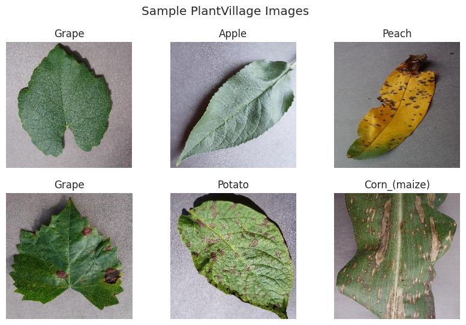
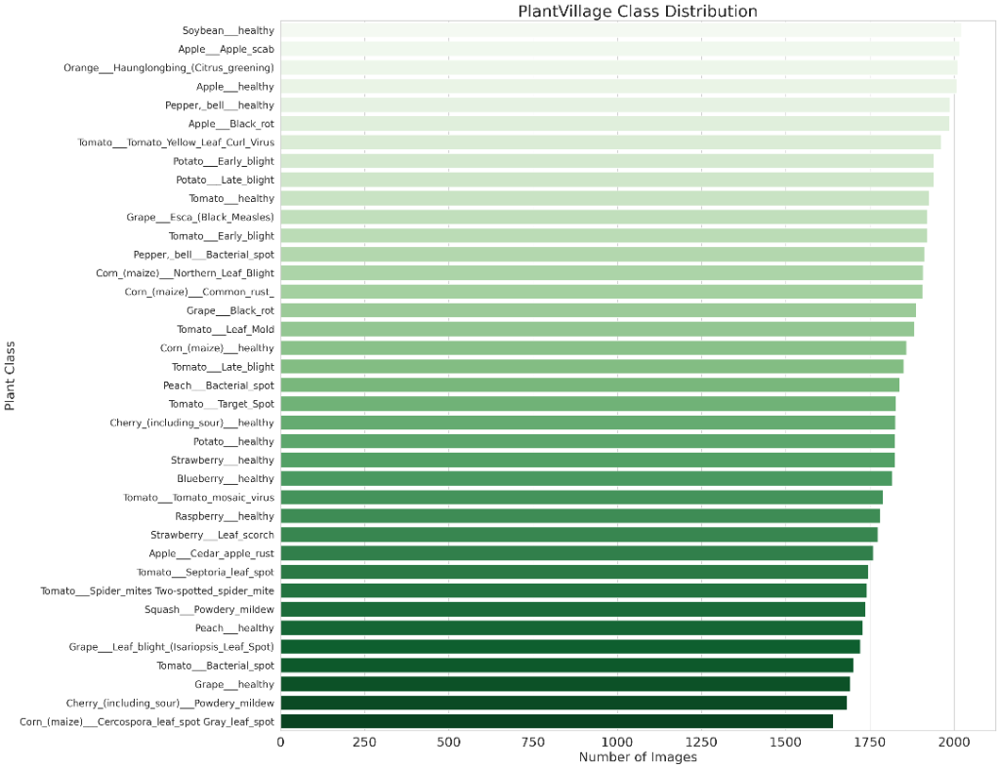
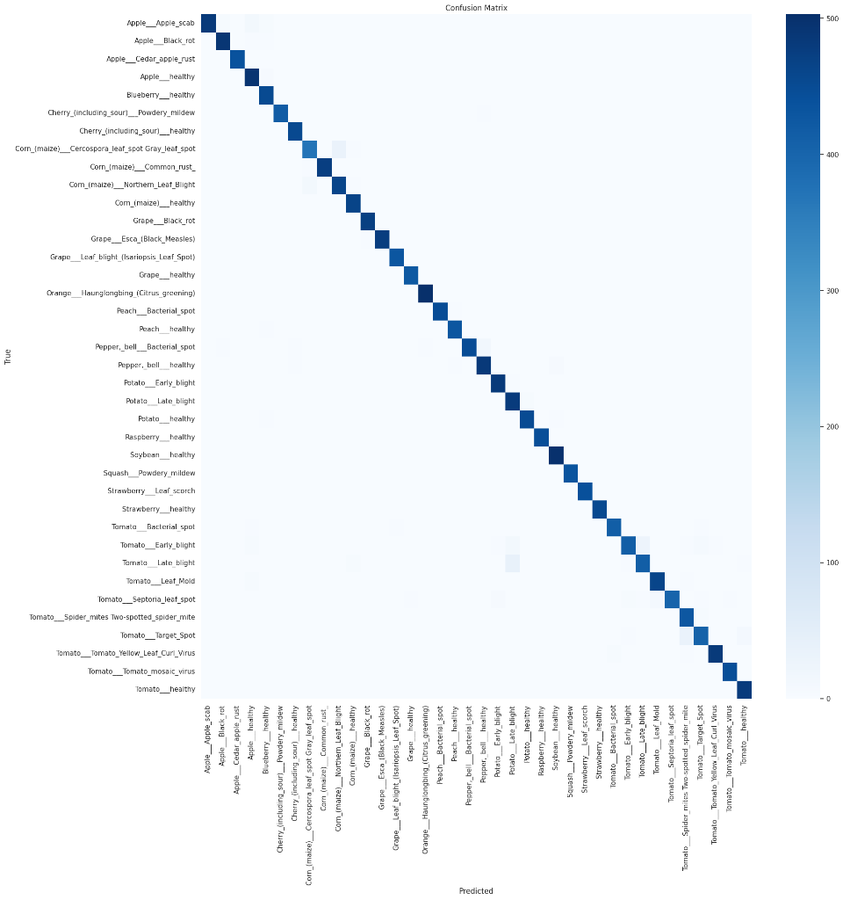

# Plant Disease Detection System 

A comprehensive AI-driven web application to detect diseases in plant leaves using Deep Learning. This project empowers farmers and agriculturists with real-time diagnostic tools, promoting healthier crops and sustainable agricultural practices.

## Features

*   **Deep Learning Model:** Uses a Custom Convolutional Neural Network (CNN) architecture trained on a vast dataset of plant leaves to identify diseases with high accuracy.
*   **Modern Web Interface:** A beautiful, responsive, and interactive frontend built with React, Vite, Tailwind CSS, and Framer Motion.
*   **Visual Diagnostics:** Highlights the methodology, datasets, model architecture, and results visually.
*   **Scalable Architecture:** Designed gracefully to be extended for more crops and diseases.

##  Tech Stack

### Frontend
*   **React 18**
*   **Vite** - Next Generation Frontend Tooling
*   **Tailwind CSS** - Utility-first CSS framework for rapid UI development
*   **Framer Motion** - Core animation library
*   **Lucide React** - Clean and modern SVG icons

### Machine Learning / Backend (Python)
*   **PyTorch / TensorFlow** (depending on the deep learning core used in `plant_disease.py`)
*   **Jupyter Notebook** (for experimentation)
*   **Pandas, NumPy, Matplotlib**

## Project Structure

```bash
Plant-Disease-Detection/
├── frontend/                   # React web application
│   ├── src/                    # Source code (Components, App layer)
│   ├── public/                 # Static assets
│   ├── index.html              # Entry HTML
│   ├── package.json            # Node dependencies and scripts
│   ├── tailwind.config.js      # Tailwind configurations
│   └── vite.config.js          # Vite configuration
├── plant_disease.py            # Deep learning model development & training script
└── plant-disease-classification.ipynb # Jupyter Notebook for exploratory data analysis
```

## Getting Started

### Prerequisites

*   **Node.js** (v18 or higher)
*   **Python** (3.8 or higher, for ML scripting)
*   **Git**

### 1. Clone the repository

```bash
git clone https://github.com/ashishnanda19/Plant-Disease-Detection.git
cd Plant-Disease-Detection
```

### 2. Frontend Setup

Navigate to the frontend directory and install the dependencies:

```bash
cd frontend
npm install
```

Run the development server:

```bash
npm run dev
```

The application will be running at `http://localhost:5173`.

### 3. Machine Learning Setup

If you wish to explore the model generation and training processes:

1. Create a Python virtual environment:
   ```bash
   python -m venv venv
   source venv/bin/activate  # On Windows: venv\Scripts\activate
   ```
2. Install necessary ML dependencies matching your environment (PyTorch, torchvision, pandas, etc.).
3. Run the scripts or open the Jupyter notebook (`plant-disease-classification.ipynb`) to explore the evaluation metrics.

## Dataset

The model utilizes the expansive **New Plant Diseases Dataset**. 
You can view the original dataset used for training [here on Kaggle](https://www.kaggle.com/datasets/vipoooool/new-plant-diseases-dataset).

### Sample Leaf Images


### Class Distribution


## Results

Our model demonstrates high classification accuracy across multiple plant diseases. The confusion matrix below highlights the specific precision rates across various crop and disease classes:



## Contributing

Contributions, issues, and feature requests are welcome!
Feel free to check out the [issues page](https://github.com/ashishnanda19/Plant-Disease-Detection/issues).


